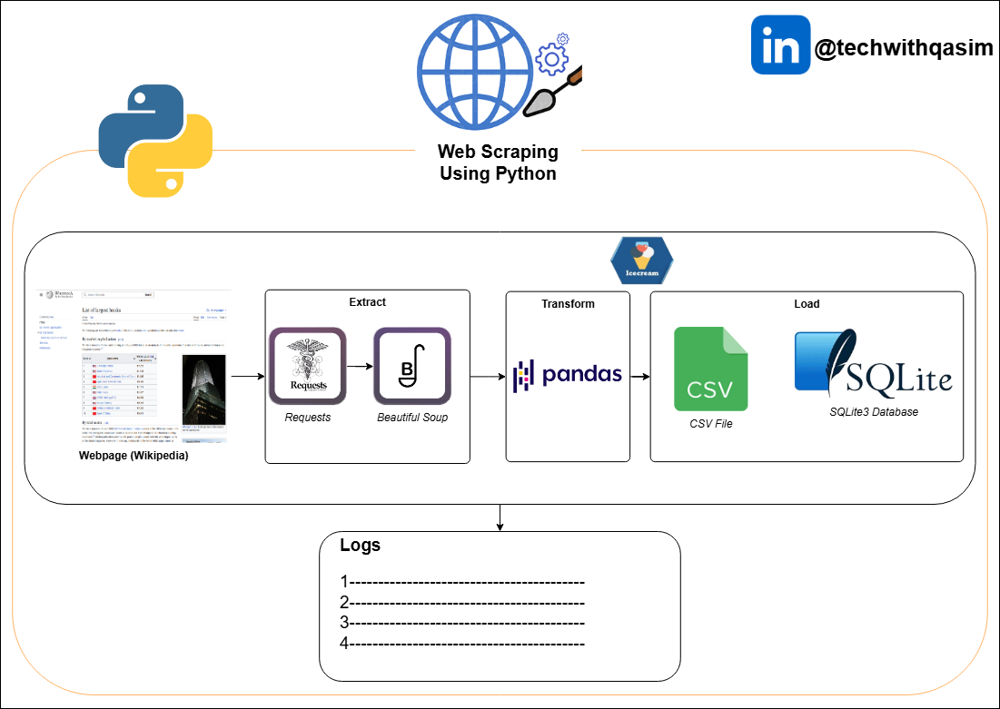

## ETL with Python using Web Scraping, Pandas & SQLite3

### Project 01 : Acquiring and processing information on world's largest banks

- Task 1: Logging Function
- Task 2 : Extraction of Data
- Task 3 : Transformation of Data
- Task 4: Loading to CSV
- Task 5: Loading to Database
- Task 6: Function to Run queries on Database
- Task 7: Verify log entries